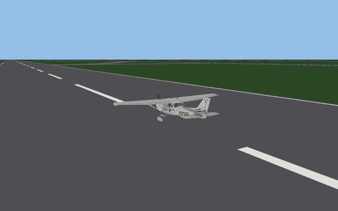
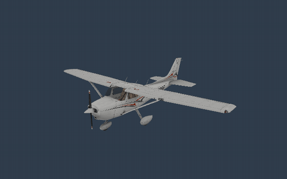
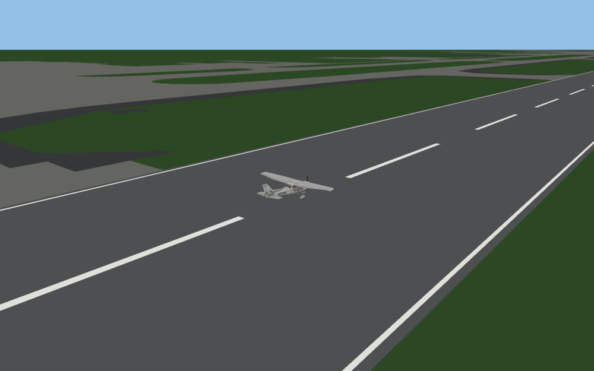
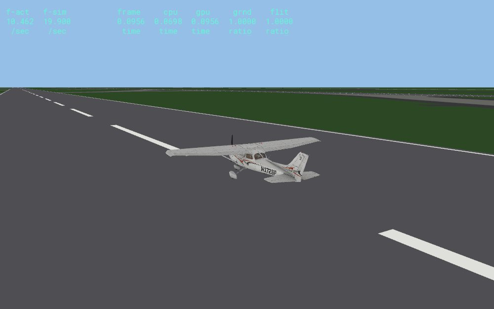

# Changelog

All notable changes. The newest is first. Versions are `MAJOR.MINOR.COMMITS` (see `scripts/version.sh`).

Every entry that changes what you can see carries a screenshot or an animation (pictures live in
`site/assets/`; the website strips the `site/` prefix).

## 0.1

### Flight model

- Every engine kind of the reference build is ported and runs inside the engine controls: electric, carburetted and
  injected piston (the Cessna 172 SP), free and fixed turboprop, with the starter, the thrust term and the propeller
  power curve. The flight step is ported block by block: the wing and body loops, the airflow wash with the body
  shadow, the part drag, the equations of motion with the velocity and rate integration, the position setter, the
  attitude quaternion, the aircraft-axes velocities, the geographic state and the flight angles, and now the whole
  ground contact chain: the landing gear and steering, the wing strip and body surface probes, the body contact
  response, the ground side force and the gear drag with the brake energy. Each is compared with the original
  machine code in an emulator.

### Datarefs

- 2388 datarefs are mapped to the field of the flight object (or the global simulation object) that the original's getter reads, with the unit factor and writability (`research/FLIGHT_DATAREFS.md`, `research/FLIGHT_FIELDS.md`).

### Viewer and scenes

- The Cessna 172 SP exterior (OBJ8 with textures, lighting and glass) and airports from apt.dat.

- The data-output lines of the reference build, drawn in its layout.

### Everything else in 0.1

- The data-output lines of the reference build (`OPENXPLANE_DATA_OUTPUT`, frame rate, speeds, attitude, position and others) and the label table of all 173 data-output lines extracted from the executable. The earlier invented instrument panel, key help and menu bar are removed.
- Ports with emulator vectors: the element planform area, the control surface deflection getter, the control surface terms function and two small helpers.
- Workspace of crates by subsystem (`xp-acf`, `xp-airfoil`, `xp-obj`, `xp-scenery`, `xp-dataref`, `xp-sim`,
  `xp-discord`, `xp-app`), with scripts, CI and nightly builds.
- Readers for ACF, OBJ8, AFL and apt.dat; the standard X-Plane folder layout and its precedence.
- The airfoil evaluation chain, the profile function and the straight-wing path of the wing element function,
  verified bit for bit against the original machine code in an emulator.
- Registries and catalogs of 5503 datarefs and 3012 commands, and the original's default keyboard map.
- An approximate flight model on the Cessna's real data, an airport ground scene from apt.dat, a chase-camera
  viewer (`fly`) and frame renderer (`fly-render`).
- Discord Rich Presence, the project website and the research notes.
