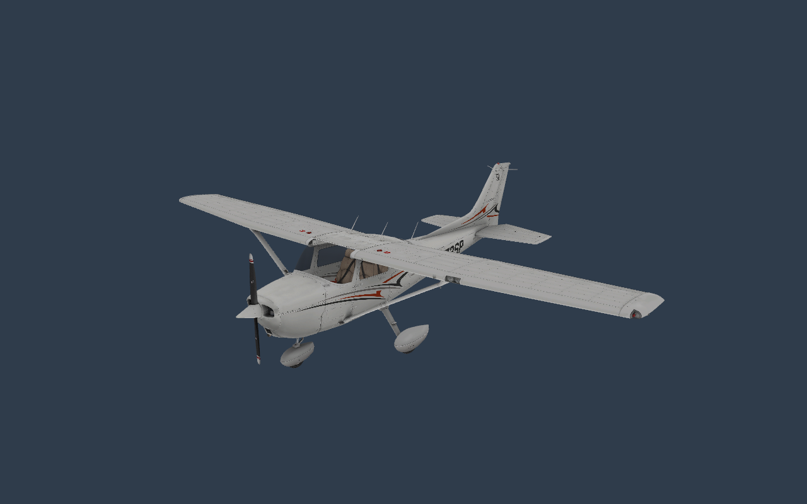
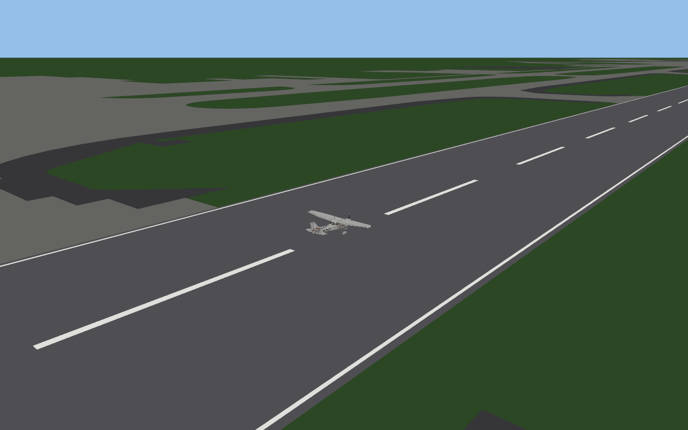
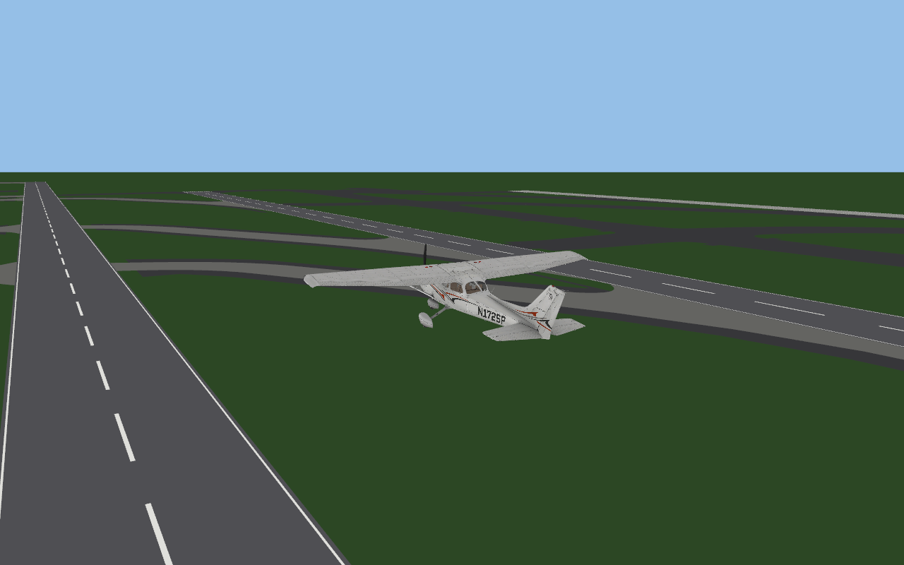

<p align="center">
  <picture>
    <source media="(prefers-color-scheme: dark)" srcset="assets/logos/wordmark-light.svg">
    
  </picture>
</p>

**openXplane** is an independent open engine with gradual compatibility with X-Plane content, written in Rust.
Approach: study the original, implement each subsystem independently, and compare the results with the
reference build. The first reference is a provided X-Plane 12.

> [!IMPORTANT]
> openXplane contains no game content. It needs an original copy of X-Plane 12 and only reads from it.



Architecture and milestones, modelled on [openOMSI](https://github.com/openOMSI-Project/openOMSI):
[docs/ARCHITECTURE.md](docs/ARCHITECTURE.md).

## Download

Every change to `main` is built by GitHub Actions and published as the rolling
[nightly release](https://github.com/OpenXPlane/openXplane/releases/tag/nightly):

| Platform | File |
| --- | --- |
| Windows x64 | `openXplane-<version>-windows-x64.zip`, run `openxplane.exe` |
| macOS (Apple silicon) | `openXplane-<version>-macos-arm64.zip`, run `openxplane` |
| Linux x64 | `openXplane-<version>-linux-x64.zip`, run `openxplane` |

There is no launcher yet: run it from a terminal and point it at your X-Plane 12 folder (see the commands below).

## Goals

1. **1:1 behaviour.** The formats and algorithms of X-Plane 12 behave as in the original, confirmed in the
   reference build and verified against its machine code.
2. **No original code or assets.** Nothing is copied; formats are described in the research notes.
3. **A better engine.** Rust, wgpu (Metal, Vulkan, DirectX 12), 64-bit, multithreaded loading.

## Documentation

| Document | What is in it |
| --- | --- |
| [Keyboard](docs/KEYBOARD.md) | the original's default keys and openXplane's own |
| [User guide](docs/USER_GUIDE.md) | install, first flights, data output |
| [Building](docs/BUILDING.md) | toolchain, tests, regenerating vectors |
| [FAQ](docs/FAQ.md) | common questions |
| [Releasing](docs/RELEASING.md) | versions, nightly builds |
| [Architecture](docs/ARCHITECTURE.md) | crates and roadmap |
| [Plan](docs/PLAN.md) | phased plan for a full implementation |
| [Compatibility](docs/COMPATIBILITY.md) | how close it is to the original, and how that is estimated |
| [Discord](docs/DISCORD.md) | Rich Presence |
| [Research notes](research/) | every recovered format and algorithm, with evidence |
| [Verification](research/VERIFICATION.md) | comparing ports against the original machine code |
| [Changelog](CHANGELOG.md) | what changed in each version |

## Repository layout

```
openXplane/
├── VERSION            MAJOR.MINOR of the next release (edited by hand)
├── crates/            the engine, one crate per subsystem
│   ├── xp-acf/          ACF aircraft files, typed parameters, lifting surfaces
│   ├── xp-airfoil/      AFL tables, the verified evaluation chain, the wing element function
│   ├── xp-obj/          OBJ8 model reader
│   ├── xp-scenery/      installation layout, apt.dat, airport ground geometry
│   ├── xp-dataref/      dataref and command registries, default keyboard map
│   ├── xp-sim/          the approximate flight model and pilot commands
│   ├── xp-discord/      Discord Rich Presence
│   └── xp-app/          the `openxplane` binary (viewer, flight, tools) and the tests against the original
├── tools/             research tools: emulator, extractors, vector generators, logo, scoring
├── scripts/           build scripts for every platform, version.sh
├── assets/            logos, screenshots, the keymap table
├── docs/              user documentation (also published on the website)
├── research/          research notes
├── site/              the GitHub Pages website
└── .github/workflows/ CI, nightly builds, the website
```

## Contributing

See [CONTRIBUTING.md](CONTRIBUTING.md). Security problems: [SECURITY.md](SECURITY.md).

<!-- compat:start -->
## How close to the original is it?

**About 34% implemented, about 19% verified identical to the original.** Early stage: it loads
the original content, draws it, and flies an approximation; it does not yet behave like X-Plane.

- *Implemented* counts work that exists in any form, including approximations (the flight model is one).
- *Verified identical* counts only what has been confirmed to match the original's own code, bit for bit.

This is a self-assessed, weighted rubric, not a measurement (method and per-subsystem numbers in
[docs/COMPATIBILITY.md](docs/COMPATIBILITY.md); data in [docs/compat.json](docs/compat.json), updated with
`python3 tools/compat_score.py --write`).

| Subsystem | Weight | Implemented | Verified identical | Notes |
|---|---:|---:|---:|---|
| Aircraft files (ACF) | 8 | 30% | 10% | All properties are preserved; typed: mass, CG, wings, gear, engine and controls subset. Loader schema of 1117 properties extracted; six values confirmed in code. |
| 3D models (OBJ8) | 7 | 35% | 5% | Geometry, nested transforms, rotation/translation animation, textures. No normal/lit maps, instruments, panels or most dynamic animation. |
| Airfoil evaluation (AFL) | 6 | 90% | 85% | All 34 airfoils; the whole profile function (selection, stall, buffet, blending, Mach factor) matches the original bit for bit on 1800 emulator cases. |
| Flight model | 28 | 56% | 43% | An approximate rigid-body model that takes off and flies. Verified against the original: the airfoil and per-element aerodynamics (control surfaces, wing element, supersonic regime), the whole engine update (power, propeller speed, thrust, starter) and the whole per-engine propeller force function (blade stations, airflow, ground effect, thrust and moment terms). The engine control orchestrator now runs every engine kind natively (piston, turboprop and electric handlers, starter, thrust). Three blocks of the flight step (wing aspect factors, rocket and blown-flap effects, the wing element loop), the body loop and the body aerodynamic functions are ported. The rest of update_flight (radiators, gear, chute, water, totals plumbing), the wind sampler, the wash and the connection of these parts to the model are not ported. |
| Datarefs and commands | 8 | 28% | 15% | Registries and catalogs of 5503 datarefs and 3012 commands from the original, its default keyboard map (71 keys), values for 6 datarefs; 30 key commands act in the flight viewer. |
| Scenery and world | 14 | 10% | 0% | Airport ground from apt.dat (runways, taxiways, aprons). No DSF, terrain, objects, lights or weather. |
| Cockpit, instruments, Lua systems | 10 | 0% | 0% | Not started. |
| Rendering | 6 | 20% | 0% | wgpu viewer with lighting and glass. No PBR, shadows, sky, clouds or instrument screens. |
| Audio, weather, multiplayer, plugins | 7 | 0% | 0% | Not started. |
| Platforms and distribution | 6 | 50% | 0% | CI on Linux, macOS and Windows, nightly builds, standard folder layout. No launcher or settings UI. |

## Roadmap

1. **Content without simulation** (mostly done): ACF, OBJ8, AFL, apt.dat and the viewer work. Left: PANEL_3D, normal/lit maps, instruments, an apt.dat index.
2. **Datarefs and commands** (in progress): Registries and original catalogs exist. Left: values for the other 5497 datarefs, command handlers, wiring to the aircraft state.
3. **Flight model** (in progress): Approximate model flies. Next: port the original wing element function piece by piece, verified in the emulator, then the force loop, engine and gear.
4. **World** (started): Airport ground from apt.dat. Left: DSF terrain, library objects, lights, start locations, weather.
5. **Cockpit and systems** (planned): Instruments, panels, the stock Cessna's Lua scripts and controls.
6. **Audio, multiplayer, plugins** (planned): Sound, networking and the plugin interface.
7. **Platforms and distribution** (started): CI and nightly builds exist. Left: a launcher, settings, tagged releases.

Next up:

- Port the wing element aerodynamics function (0x1411b6630) in verified pieces
- Fill datarefs from the aircraft state and drive them from the flight model
- Read DSF scenery tiles for terrain under the airport
- Recover the engine and propeller model
- Instruments and the stock Cessna's Lua scripts

Details and the target crate layout: [docs/ARCHITECTURE.md](docs/ARCHITECTURE.md).
<!-- compat:end -->

## Current state

The ACF property loader, OBJ8 geometry reading and a static-view window of the stock Cessna on wgpu all work.
The Metal backend is verified on this Mac. There is no flight simulation yet.

From the analysis of the original EXE, typed reading of mass, maximum fuel, centre-of-gravity coordinates and
engine count has been added. Unit conversion factors keep the float32 values of the reference build.

```sh
cargo run --offline -- aircraft-info "Xplane12/Cessna 172 SP/Cessna_172SP.acf"
```

Results and the limits of the confirmed behaviour: [research/ACF_LOADING.md](research/ACF_LOADING.md).

AFL 1110 is read: header, shape points, parameters and several Cl/Cd/Cm tables of 721 rows each. All 34 provided
airfoils have been checked. To print values at an angle of attack of 5°:

```sh
cargo run --offline -- airfoil-info "Xplane12/Airfoils/NACA 2412 (popular).afl" 5
```

Sampling is linear inside each table, with no regime blending and no flight-model corrections.
Research: [research/AIRFOILS.md](research/AIRFOILS.md).

The section of angle correction and fixed-grid lookup confirmed in the EXE is implemented separately.
Arguments: the angle after the previous stages, and the correction multiplier and divisor. For example:

```sh
cargo run --offline -- airfoil-eval "Xplane12/Airfoils/NACA 2412 (popular).afl" 10 1 2
```

The command shows the effective angle, the indices, the weights and the coefficients of each table. The multiplier
and divisor are still given by hand: how they are obtained for a wing, the later corrections and the integration
of forces are not implemented yet. Formulas and addresses: [research/AERO_LOOKUP.md](research/AERO_LOOKUP.md).

`airfoil-eval` also prints the normalised angle and the stall state without memory of the previous state. The
library has a mode with the original's hysteresis: it switches on above 1 and resets below 0.75 of the absolute
normalised angle. The Cl/Cd changes of the later perturbation function are not applied yet.
Evidence: [research/STALL_STATE.md](research/STALL_STATE.md).

The separate `buffet` module implements the perturbation generator and the active-stall Cl/Cd corrections. The
shared noise table and the time in seconds are passed in explicitly. The time source is established:
`sim/time/total_running_time_sec`. The `runtime` module reproduces the double storage and access through a float32
dataref. Noise initialisation and time advance are not recovered yet, so this module is not wired into
`airfoil-eval` automatically. Check with a given table:

```sh
cargo run --offline -- buffet-eval table.f32le 0 0 0 0 2 0.25 -0.1
```

The table is 262144 little-endian float32 numbers. Arguments after it: x, y, phase, time in seconds (the internal
double), Cl, Cd, Cm. Research: [research/BUFFET.md](research/BUFFET.md),
[research/RUNTIME_TIME.md](research/RUNTIME_TIME.md).

Choosing a pair of tables and blending the results by an input parameter:

```sh
cargo run --offline -- airfoil-mix "Xplane12/Airfoils/NACA 2412 (popular).afl" 5 1 1 0.75
```

The last argument is given in the scale of the AFL file's `parameters[0]`. The units of this input and its
computation in the flight model are not established yet. The command blends the implemented lookup stage; the
original blends the outputs of a fuller evaluator. Research: [research/AFL_REGIMES.md](research/AFL_REGIMES.md).

The loader keeps unknown properties, their order, repeats, string values and line numbers. It reads the
`PROPERTIES_BEGIN` / `PROPERTIES_END` section; the other sections, including `PANEL_3D`, are not interpreted yet.
The file version is kept as metadata, not as a guarantee that a whole X-Plane version is supported.

```sh
cargo run --offline -- inspect Xplane12
cargo test --offline
python3 tools/inspect_pe.py Xplane12/X-Plane.exe
python3 tools/find_acf_xrefs.py Xplane12/X-Plane.exe
```

`inspect` takes a content directory, finds ACF files recursively, checks the references to models and airfoils and
parses the AFL files it finds. Exit code: 0 - the checked references and AFL files are fine, 2 - dependencies are
missing or there are AFL errors, 1 - an ACF read or format error, or bad arguments. Textures, panels, Lua, sound
and scenery are not checked by this command yet.

## Unified profile evaluator

`profile` combines angle correction, AFL lookup, the shared stall memory for the chosen table pair, perturbations
and result blending. The `airfoil-replay` command carries the state between the rows of an input CSV:

```sh
cargo run --offline -- airfoil-replay "Xplane12/Airfoils/NACA 2412 (popular).afl" examples/profile-replay.csv research/local/runtime-snapshot/noise.f32le 0
```

An active stall needs an explicitly passed noise table. The `tools/capture_xplane_runtime.py` tool is prepared to
read it from the original on Windows; its Windows branch is not verified yet. Without an active stall, `-` can be
passed instead of the table. The evaluator creates no forces and moves no aircraft; flight-model inputs are given
explicitly. Instructions and confirmation of the state order:
[research/PROFILE_PIPELINE.md](research/PROFILE_PIPELINE.md).

## Cessna viewer

```sh
cargo run --offline -- view "Xplane12/Cessna 172 SP/Cessna_172SP.acf"
```

Left mouse button and movement rotate the camera; the wheel zooms; `R` resets; `Esc` closes. The window redraws
on camera and size changes, not continuously in the background.

To save an image without a window:

```sh
cargo run --offline -- render "Xplane12/Cessna 172 SP/Cessna_172SP.acf" /tmp/cessna.png
```

Diagnostics of all attached OBJ files:

```sh
cargo run --offline -- mesh-info "Xplane12/Cessna 172 SP/Cessna_172SP.acf"
```

`mesh-info` continues after errors in individual objects. It returns 2 if a file could not be read or parsed or a
base texture is missing. Unsupported commands are listed separately and do not by themselves mean a geometry error.

The viewer uses seven objects: fuselage, landing gear, propeller, wings, front and rear seats, and the outer glass.
All animation datarefs are 0. This is the chosen set of geometry for the first view, not a reproduction of the
aircraft state. VT/IDX/IDX10/TRIS, the nested transform stack, rotation and translation keys, show/hide, a DDS
lookup in place of the declared PNG, base colour, lighting and approximate glass transparency work. 4x MSAA is
supported.

Limitations: no normal/lit maps, PBR, mipmaps, mirrors, instrument screens, clickable controls or simulation.
Geometry is still double-sided; glass is sorted per object; LOD is fixed to the first set; non-zero ACF attachment
poses are rejected. All attached OBJ files of the three provided Cessna variants pass geometry parsing; this does
not mean all their commands or the full display of the aircraft are supported.
Protocol: [research/VIEWER.md](research/VIEWER.md).

Installation layout. A standard X-Plane folder (`Aircraft/`, `Airfoils/`, `Custom Data/`, `Custom Scenery/`,
`Global Scenery/`, `Resources/`) is supported with its folder precedence: `Custom Data/` before
`Resources/default data/`, scenery packs from `scenery_packs.ini` before Global Airports before the default
`apt.dat`, an aircraft's own `airfoils/` before the shared `Airfoils/`. Evidence and which rules are only
documentation-based: [research/INSTALL_LAYOUT.md](research/INSTALL_LAYOUT.md).

The minimal layout used while only a few files were provided is still accepted:

```text
Xplane12/
├── X-Plane.exe
├── Cessna 172 SP/
├── Airfoils/
└── Earth nav data/
    ├── apt.dat
    └── earth_nav.dat
```

The content directory and local reports are excluded from Git. The engine must read user content separately from
its own code. The research tools do not modify the original files.

## Airport scene

```sh
cargo run --offline -- airport-render Xplane12 KSEA "Xplane12/Cessna 172 SP/Cessna_172SP.acf" ksea.png
cargo run --offline -- airport-view Xplane12 KSEA "Xplane12/Cessna 172 SP/Cessna_172SP.acf"
```

Draws an airport from `apt.dat` (runways with markings, taxiway and apron pavements with holes) and puts the
aircraft on the first runway. Static, no terrain or objects. Rules and limits:
[research/WORLD_GEOMETRY.md](research/WORLD_GEOMETRY.md).



## Datarefs

```sh
cargo run --offline -- datarefs "Xplane12/Cessna 172 SP/Cessna_172SP.acf"
python3 tools/extract_datarefs.py Xplane12/X-Plane.exe --prefix sim/aircraft/weight/
```

`datarefs` registers the datarefs whose backing ACF fields are confirmed in the original (empty, maximum and fuel
mass, CG Y/Z, engine count) with the type and writability of the reference build. `extract_datarefs.py` lists all
5503 registration records of the original's table. Layout, evidence and limits:
[research/DATAREFS.md](research/DATAREFS.md).

## Flight (approximate flight model)

```sh
cargo run --release --offline -- fly Xplane12 KSEA "Xplane12/Cessna 172 SP/Cessna_172SP.acf"
cargo run --release --offline -- fly-render Xplane12 KSEA "Xplane12/Cessna 172 SP/Cessna_172SP.acf" frame 0 20 30 45
cargo run --release --offline -- wing-info "Xplane12/Cessna 172 SP/Cessna_172SP.acf"
cargo run --release --offline -- fly-test Xplane12 "Xplane12/Cessna 172 SP/Cessna_172SP.acf" 60
```

`fly` opens a window with the Cessna on the first runway of the airport. It uses the **original's default
keyboard map**, read from the reference build: F1/F2/F3 throttle down/up/full, `1`/`2` flaps up/down, `B` brakes
(hold), `V` maximum brakes, `[` `]` pitch trim, `5 6 7` rudder trim, `8 9 0` aileron trim, `P` pause, `W` default
view, `Q E R F` and `= -` move the camera. The original has no keyboard stick, so openXplane adds one: arrow keys
pitch and roll, `Z`/`X` rudder (`Tab` gives them their original meaning back), `Delete` resets, `Esc` quits. `OPENXPLANE_DATA_OUTPUT=0,3,4,17,18,21` draws the reference build's data-output lines with those indexes (the Data Output list of X-Plane: 0 frame rate, 3 speeds, 4 Mach and vertical speed, 8 stick, 13 trims and flaps, 17 attitude, 18 alpha and flight path, 20 altitude, 21 position and velocity, 25 throttle; `OPENXPLANE_FRAME_RATE=1` adds line 0); see `crates/xp-app/src/dout.rs`.
Commands without anything to act on yet (mixture, magnetos, carb heat...) are reported in the window title as not
simulated. The title also shows speed, altitude, vertical speed, pitch, bank, heading, throttle, flaps and a stall
warning. Full table: [docs/KEYBOARD.md](docs/KEYBOARD.md); source of the map: [research/KEYMAP.md](research/KEYMAP.md).
`fly-render` runs a scripted takeoff and saves chase-camera frames at the given times.



An approximate rigid-body model on the Cessna's real ACF and airfoil data: the wing is split into elements and
each one uses the airfoil code verified against the original; thrust, landing gear and control surfaces are
openXplane's own simplifications. It takes off and climbs under a scripted pilot. It is **not** the original's
flight model; what is original and what is assumed is listed in
[research/FLIGHT_MODEL.md](research/FLIGHT_MODEL.md).

## Verification against the original machine code

`tools/emulate_xp.py` runs isolated functions of `X-Plane.exe` in a CPU emulator on synthetic inputs, and
`tests/original_vectors.rs` requires the Rust port to match their outputs bit for bit: 1200 cases of the profile
stage (angle correction, lookup, stall, buffet noise) and the interpolation helper all agree. Method and limits:
[research/VERIFICATION.md](research/VERIFICATION.md).

## ACF loader schema

```sh
python3 tools/extract_acf_schema.py Xplane12/X-Plane.exe > research/local/acf-schema.tsv
```

Lists the 1117 ACF property reads the original's loader performs in a recognisable shape, with the field offset,
reader type and unit coefficient (wing geometry, part positions, engine fields). Evidence and limits:
[research/ACF_SCHEMA.md](research/ACF_SCHEMA.md).

## Commands

```sh
python3 tools/extract_commands.py Xplane12/X-Plane.exe > research/local/commands.tsv
cargo run --offline -- commands research/local/commands.tsv sim/flight_controls/flaps
```

The original's command table (3012 built-in commands) is enumerated by the tool, and `CommandRegistry` loads it
and runs begin/continue/end phases through handler chains. Layout, evidence and limits:
[research/COMMANDS.md](research/COMMANDS.md).

## Airports (apt.dat)

```sh
cargo run --offline -- airport-info "Xplane12/Earth nav data/apt.dat" KSEA
cargo run --offline -- airport-info Xplane12 KSEA   # whole installation, priority order
```

Reads one airport as a stream: the header, the metadata (1302) and the land runways (100). The other rows are only
counted. Exit code 2 if the ICAO code is not found. Limits and verification:
[research/APT_DAT.md](research/APT_DAT.md).

## Discord

While the viewer is open, Discord Rich Presence can show what you are looking at. It uses the project's own
Discord application (set `OPENXPLANE_DISCORD_APP_ID` to an empty value to turn it off, or to another id to use your
own); details and limits: [docs/DISCORD.md](docs/DISCORD.md). The
website gets a Discord button as soon as an invite link is set in `site/app.js`.

## Roadmap

1. Continue analysing the original EXE's loaders and confirm the ACF/OBJ rules.
2. Extend OBJ8: instruments, materials, normal/lit maps, dynamic animations.
3. Datarefs, commands and the runtime of the stock Cessna's Lua scripts.
4. Application of the AFL tables, ACF parameters, engines, landing gear and aerodynamics, with measurements in
   the original.
5. apt.dat, DSF and the library dependencies of one test airport.

Support for X-Plane 10/11 and third-party binary plugins comes in later stages. There is no timeline for full
compatibility yet.

Results of the first investigation: [research/BASELINE.md](research/BASELINE.md).

## License

GPL-3.0-or-later, see [LICENSE](LICENSE) and [NOTICE](NOTICE). X-Plane is a trademark of its respective owner. openXplane is an independent
project and is not affiliated with it.
